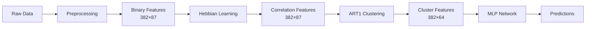

# Adaptive Learning System

A neural learning pipeline that combines **Hebbian Learning**, **ART1 Clustering**, and **Multi-Layer Perceptron (MLP)** for student performance prediction. The system processes student data through three sequential learning stages, where each model's output feeds into the next.

## Dataset
UCI Student DataSet

## 🎯 Overview

This project implements a novel approach to student performance prediction by chaining three different neural learning paradigms:

```
Binary Student Data → Hebbian Learning → ART1 Clustering → MLP → Performance Prediction
```

### Pipeline Architecture



### Key Features

- **Sequential Learning Pipeline**: Three models working in harmony
- **Hebbian Learning**: Unsupervised correlation-based feature learning
- **ART1 Network**: Adaptive resonance theory for pattern clustering
- **Deep Learning**: PyTorch-based MLP for final predictions
- **End-to-End Training**: Single command trains entire pipeline
- **Model Persistence**: Save and load complete pipeline

## 📊 Model Architecture

| Stage | Model | Input Shape | Output Shape | Purpose |
|-------|-------|-------------|--------------|---------|
| 1 | **Hebbian** | 382×87 | 382×87 | Learn feature correlations |
| 2 | **ART1** | 382×87 | 382×64 | Discover pattern clusters |
| 3 | **MLP** | 382×64 | 382×1 | Final prediction |

**Total Parameters**: ~19,000 across all three models

## 🚀 Quick Start

### Prerequisites

- Python 3.8+
- CUDA-capable GPU (optional, but recommended)

### Installation

1. **Clone the repository**
```bash
git clone https://github.com/yourusername/AdaptiveLearningSystem.git
cd AdaptiveLearningSystem
```

2. **Install dependencies**
```bash
pip install -r requirements.txt
```

3. **Install PyTorch** (if not already installed)
```bash
# For CUDA 11.8
pip install torch torchvision torchaudio --index-url https://download.pytorch.org/whl/cu118

# For CPU only
pip install torch torchvision torchaudio
```

### Usage

#### Training the Pipeline

Run the complete pipeline with a single command:

```bash
python main.py
```

This will:
1. Load and preprocess student data
2. Train Hebbian learning model
3. Train ART1 clustering on Hebbian features
4. Train MLP on ART1 cluster features
5. Save all models to `models/` directory

**Expected Output:**
```
============================================================
ADAPTIVE LEARNING SYSTEM - PIPELINE MODE
============================================================

[STAGE 1/3] Hebbian Learning
✓ Hebbian weight matrix computed: (87, 87)
✓ Data transformed: (382, 87)

[STAGE 2/3] ART1 Clustering
✓ Number of clusters formed: 64
✓ Cluster features created: (382, 64)

[STAGE 3/3] MLP Training
Epoch [50/50], Loss: 0.5196, Val Loss: 0.6739
✓ MLP training complete
```

#### Testing the Pipeline

Test the trained pipeline and inspect intermediate outputs:

```bash
python test_pipeline.py
```

#### Making Predictions

```python
from src.pipeline import AdaptiveLearningPipeline
import pandas as pd

# Load trained pipeline
pipeline = AdaptiveLearningPipeline()
pipeline.load_pipeline(prefix="pipeline")

# Load binary data
X_binary = pd.read_csv("data/processed/student_binary.csv").values

# Make predictions
predictions = pipeline.predict(X_binary)
print(predictions)
```

## 📁 Project Structure

```
AdaptiveLearningSystem/
├── data/
│   ├── raw/              # Original student datasets
│   └── processed/        # Preprocessed data (binary, normalized)
├── models/               # Saved model weights
├── src/
│   ├── preprocessing/    # Data cleaning and transformation
│   ├── hebbian/         # Hebbian learning implementation
│   ├── art1/            # ART1 network implementation
│   ├── mlp/             # MLP model and trainer
│   └── pipeline.py      # Pipeline orchestrator
├── notebooks/           # Jupyter notebooks for exploration
├── main.py             # Main training script
├── test_pipeline.py    # Testing and demonstration
└── requirements.txt    # Python dependencies
```

## 🧠 Learning Models

### 1. Hebbian Learning

Implements correlation-based learning using the Hebbian rule: "Neurons that fire together, wire together."

**Key Features:**
- Computes correlation matrix from binary features
- Supports bipolar representation (-1/+1)
- Transforms input data using learned weights

**Implementation:** [`src/hebbian/hebbian_learning.py`](src/hebbian/hebbian_learning.py)

### 2. ART1 Network

Adaptive Resonance Theory (ART1) for unsupervised binary pattern clustering.

**Key Features:**
- Dynamic cluster creation
- Vigilance parameter controls cluster granularity
- One-hot encoded cluster features

**Implementation:** [`src/art1/art1_network.py`](src/art1/art1_network.py)

### 3. Multi-Layer Perceptron (MLP)

Deep neural network for final prediction using PyTorch.

**Architecture:**
- Input Layer: 64 neurons (cluster features)
- Hidden Layer 1: 64 neurons (ReLU)
- Hidden Layer 2: 32 neurons (ReLU)
- Output Layer: 1 neuron (Sigmoid)
- Dropout: 0.2 for regularization

**Implementation:** [`src/mlp/model.py`](src/mlp/model.py)

## 📈 Dataset

The system uses student performance data with:
- **Samples**: 382 students
- **Features**: 87 binary features (after preprocessing)
- **Target**: Student grade (G3)

**Preprocessing Steps:**
1. Data cleaning and merging
2. Normalization (min-max scaling)
3. Binarization (threshold-based)

## 🔧 Configuration

### Hebbian Parameters

```python
hebbian_params = {
    'bipolar': False  # Use 0/1 instead of -1/+1
}
```

### ART1 Parameters

```python
art1_params = {
    'alpha': 0.01,           # Choice parameter
    'rho': 0.8,              # Vigilance parameter
    'max_categories': 500    # Maximum clusters
}
```

### MLP Parameters

```python
mlp_params = {
    'hidden_size': 64,
    'learning_rate': 0.001,
    'epochs': 50
}
```

## 📊 Results

After training on the student dataset:

- **Hebbian Features**: 87 correlation-based features
- **ART1 Clusters**: 64 distinct pattern clusters discovered
- **MLP Performance**: 
  - Training Loss: 0.5196
  - Validation Loss: 0.6739

## 🛠️ Advanced Usage

### Custom Pipeline Configuration

```python
from src.pipeline import AdaptiveLearningPipeline

# Create pipeline with custom parameters
pipeline = AdaptiveLearningPipeline(
    hebbian_params={'bipolar': True},
    art1_params={'alpha': 0.01, 'rho': 0.9, 'max_categories': 100},
    mlp_params={'hidden_size': 128, 'learning_rate': 0.0001, 'epochs': 100}
)

# Train
results = pipeline.fit(X_binary, y, verbose=True)

# Save with custom prefix
pipeline.save_pipeline(prefix="custom_model")
```

### GPU Configuration

To use a specific GPU, modify the environment variable in [`src/mlp/trainer.py`](src/mlp/trainer.py):

```python
os.environ["CUDA_VISIBLE_DEVICES"] = "0"  # Use GPU 0
```

## 📝 API Reference

### AdaptiveLearningPipeline

Main pipeline class for training and inference.

**Methods:**

- `fit(X_binary, y, verbose=True)` - Train the complete pipeline
- `predict(X_binary)` - Make predictions on new data
- `save_pipeline(prefix="pipeline")` - Save all models
- `load_pipeline(prefix="pipeline")` - Load saved models

### Individual Models

Each model can also be used independently:

```python
from src.hebbian.hebbian_learning import HebbianLearner
from src.art1.art1_network import ART1
from src.mlp.trainer import MLPTrainer

# Use models separately
hebbian = HebbianLearner(bipolar=False)
art1 = ART1(num_features=87, rho=0.8)
mlp = MLPTrainer(input_size=64)
```

## 🤝 Contributing

Contributions are welcome! Please feel free to submit a Pull Request.

## 📄 License

This project is licensed under the MIT License - see the LICENSE file for details.

## 👥 Authors

- Aditya Chandra - Initial work

## 🙏 Acknowledgments

- Student performance dataset from UCI Machine Learning Repository
- Inspired by biological neural learning principles
- Built with PyTorch, NumPy, and Pandas

## 📧 Contact

For questions or feedback, please open an issue on GitHub.

---

**⭐ If you find this project useful, please consider giving it a star!**
